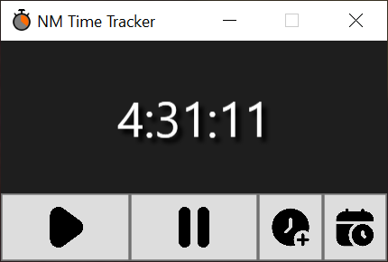
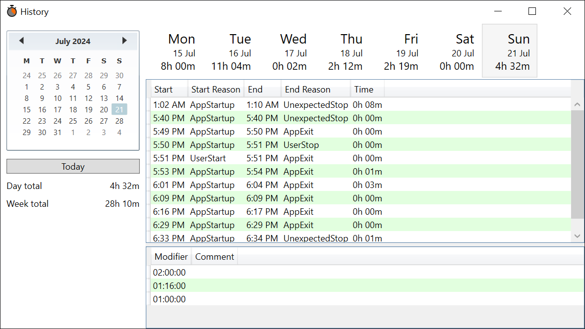

# NMTimeTracker

NMTimeTracker is essentially a software punch clock, meant to help with work-from-home time tracking.

## Features

* Simply counts time.
* By default, starts counting time on startup, pauses if the windows session is locked, unpauses when the session is unlocked, stops counting on application exit.
* Unobtrusive, minimizes to app tray.
* Time data is persistent. It's stored locally in a SQLite database in `%AppData%\NMTimeTracker\data.sqlite`.
* No calls home or data collection. 
* That's it. It's extremly simple right now, but I might add features if requested.

## Screenshots

## Changes

### v0.3

* Implemented option to pause the timer when screen saver comes on. This is
  necessary, because Windows screen savers do not lock the session when they
  come on, they only lock it when the user tries to exit them.
* Added "Add modifier..." item to the History window's context menu.
* Added "+8 hours" and "+4 hours" buttons to the "New Modifier" and "Edit
  Modifier" dialogs.
